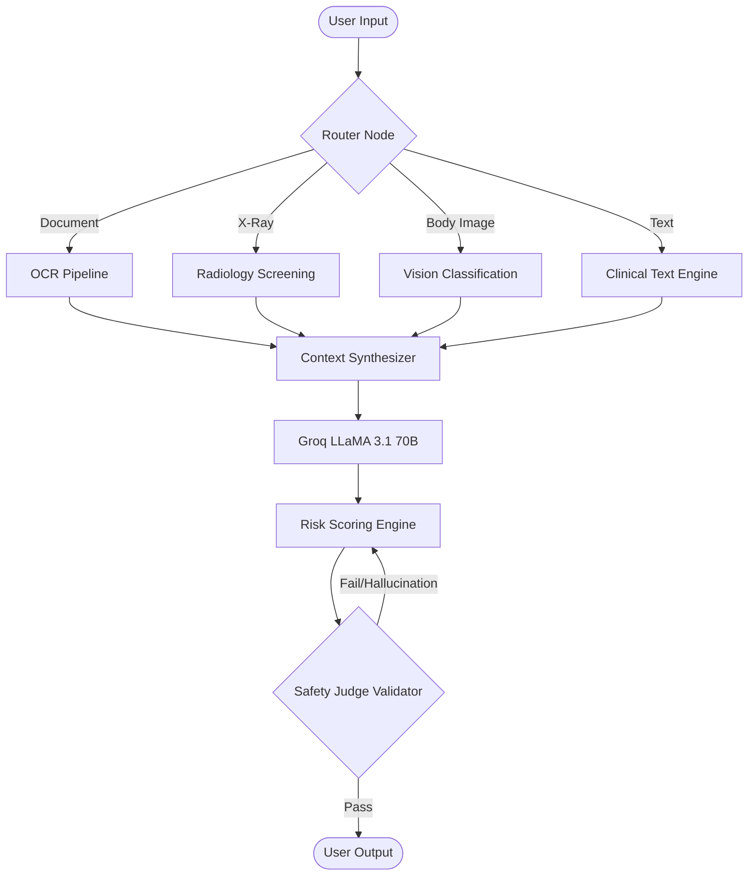

<div align="center">

# 🛡️ TriGuard AI

**Multimodal Medical Triage Assistant (V6.0)**

[](https://github.com/620593/TriGuard-AI-Medical-Triage-Assistant)
[](https://python.org)
[](https://fastapi.tiangolo.com/)
[](https://reactjs.org/)
[](https://www.mongodb.com/)
[](#)

_A production-grade multimodal medical triage system designed to provide rapid, safe, and intelligent health risk assessments._

</div>

---

## 🚀 Introducing The V6 "Intelligent Continuity" Update

Version 6.0 introduces a massive structural leap, finalizing the architecture with **Google OAuth**, **persistent cross-session memory**, **OTC Medication suggestions**, and a fully redesigned **React 19 + Framer Motion UI**. The system now maintains complete conversational continuity across triage sessions!

### 🌟 What's New in V6

| Feature                             | Description                                                                                                                                                                                           | Impact                                   |
| ----------------------------------- | ----------------------------------------------------------------------------------------------------------------------------------------------------------------------------------------------------- | ---------------------------------------- |
| �️ **Authentication 2.0**            | Secure login system featuring **Google OAuth** integration, JWT-based protected routes, and Axios 401 interceptors.                                                                                   | Seamless & secure onboarding.            |
| 🧠 **In-Session Memory**            | True conversational flow! The AI remembers previous turns inside the same session so you don't have to repeat your symptoms repeatedly. Uses MongoDB session ID mapping.                              | Fluid conversational triage.             |
| 💊 **OTC & Nutrition Integrations** | Now safely suggests over-the-counter medications and dietary nutrition tips when triggered by the triage logic and verified safely.                                                                   | Actionable holistic advice.              |
| 🎨 **UI Redesign**                  | Breathtaking Frontend redesign utilizing React 19, Tailwind CSS 4, and Framer Motion micro-interactions. Offers split-screen glassmorphic layouts.                                                    | Premium visual experience.               |
| � **Deep Document Pipeline**        | A robust `DOCUMENT → OCR → TEXT` flow. Uploading medical reports, prescriptions, or lab results automatically triggers high-precision OCR and feeds extracted symptoms into our clinical text engine. | High precision medical record ingestion. |
| 🌍 **Native Multilingual**          | Triage instructions are embedded directly in the LLM prompt, simplifying complex jargon locally for diverse users.                                                                                    | Inclusive, fast responses globally.      |

---

## ✨ Core Platform Features

- 💬 **Multimodal AI Triage:** Intelligent analysis for Text, Voice, Body Images (Skin/Dermatology), and X-rays.
- 🎙️ **Voice First UX:** Seamless Whisper STT and gTTS integration for hands-free medical input.
- 🩻 **Radiology Screening:** Specialized pre-diagnosis nodes for chest X-ray analysis _(Note: For screening only)_.
- 🧩 **Deterministic Logic:** Orchestrated via **LangGraph**, ensuring clinical routing follows strict protocols rather than unpredictable LLM decisions.
- 📊 **Risk Scoring Engine:** Real-time risk-level calculation (Low to Critical) with structured Red-Flag detection.
- 🏛️ **Persistence with Privacy:** Opt-in session history (`use_history`) with MongoDB secondary persistence.
- 🥗 **Integrated Nutrition:** Triage-aware dietary advice provided alongside medical assessments.
- ⚖️ **Judge Validator:** An internal AI "Judge" validates every response for hallucinations, medical safety, and adherence to triage constraints before it reaches the user.

---

## 🏗️ Architecture Overview

The V6 architecture utilizes LangGraph for a robust, state-driven execution environment:



The project follows a modular **Monorepo** structure:

```text
TriGuard-AI/
├── backend/           # FastAPI + LangGraph + MongoDB
│   ├── src/
│   │   ├── nodes/     # Pure node logic (Vision, OCR, Brain, Risk, etc.)
│   │   ├── graph/     # LangGraph state machines and routing
│   │   ├── tools/     # API connectors (Groq, Tavily, MongoDB)
│   │   └── state/     # TypedDict state contracts
│   └── tests/         # Comprehensive V6 test suite
├── frontend/          # React 19 + Framer Motion + Tailwind 4
└── README.md          # Version 6.0 Documentation
```

---

## 🛠️ Technology Stack

| Category          | Technology                                                   |
| :---------------- | :----------------------------------------------------------- |
| **Reasoning/NLP** | Groq LLaMA 3.1 70B (Brain), LLaMA 3 8B (Classification)      |
| **Vision/OCR**    | Groq Vision-LLaVA, Tesseract/OCR-Engine                      |
| **Orchestration** | LangGraph (Stateful Multi-actor Graph)                       |
| **Backend**       | Python 3.12, FastAPI, Pydantic V2, Motor, bcrypt             |
| **Frontend**      | React 19, Framer Motion (premium animations), Tailwind CSS 4 |
| **Search/RAG**    | Tavily AI (Medical web search)                               |

---

## 🚀 Getting Started

Follow these steps to deploy TriGuard AI v6.0 locally.

**1. Install Core Dependencies**

```bash
pip install uv
```

**2. Setup Backend Server**

```bash
cd backend
uv sync
```

**3. Setup Frontend Client**

```bash
cd frontend
npm install
```

**4. Environment Variables (`backend/.env`)**
Create a `.env` file in the `backend/` directory with your API keys:

```env
GROQ_API_KEY="your_groq_api_key_here"
TAVILY_API_KEY="your_tavily_api_key_here"
GEMINI_API_KEY="your_gemini_api_key_here"
MONGODB_URI="mongodb://localhost:27017"
JWT_SECRET_KEY="your_jwt_secret_key_here"
GOOGLE_CLIENT_ID="your_google_client_id_here"
GOOGLE_CLIENT_SECRET="your_google_client_secret_here"
TRIGUARD_ALLOWED_ORIGINS="http://localhost:5173,http://localhost:3000"
TRIGUARD_ENV="development"
TWILIO_ACCOUNT_SID="your_twilio_account_sid_here"
TWILIO_AUTH_TOKEN="your_twilio_auth_token_here"
TWILIO_FROM_NUMBER="+1234567890"
```

---

## ⚖️ Legal Disclaimer

> **IMPORTANT:** TriGuard AI is an AI assistant intended for informational purposes only. It is **NOT** a substitute for professional medical advice, diagnosis, or treatment. Always seek the advice of your physician or other qualified health provider with any questions you may have regarding a medical condition. Do not disregard professional medical advice or delay in seeking it because of something you have read on this application.

---

<div align="center">
&copy; 2026 TriGuard AI Team | <a href="https://github.com/620593/TriGuard-AI-Medical-Triage-Assistant">Visit Repository</a>
</div>
